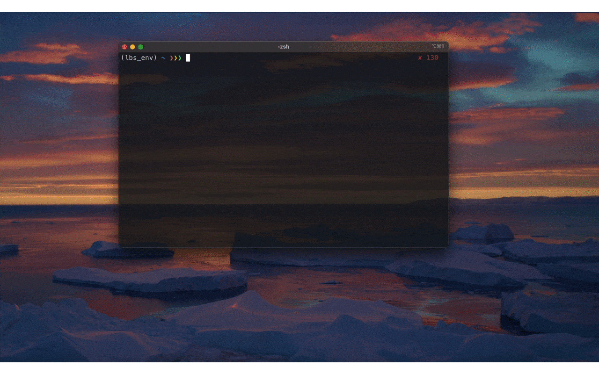

# e2e_pointing_sys

This is a script to run the e2e simulation of pointing systematics for LiteBIRD.

- `e2e_pointing_systematics.py`
  - It includes a functions to simulate the pointing systematics.
- `sora_run_pointing_systematics.py`
  - The code runs the e2e simulation in JSS3-SORA
- `ruri_run_pointing_systematics.py`
  - The code runs the e2e simulation in JSS3-RURI

# GIF display test

